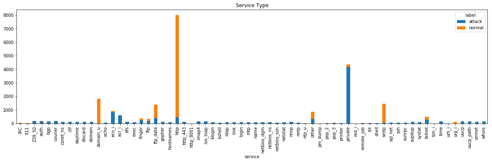
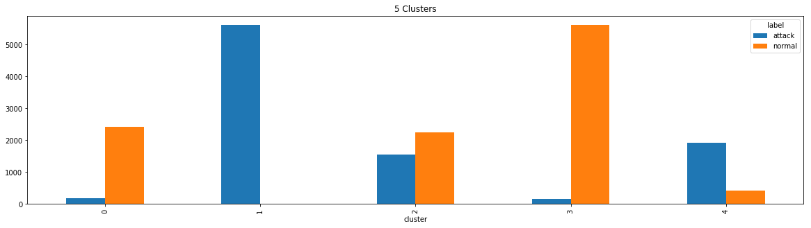
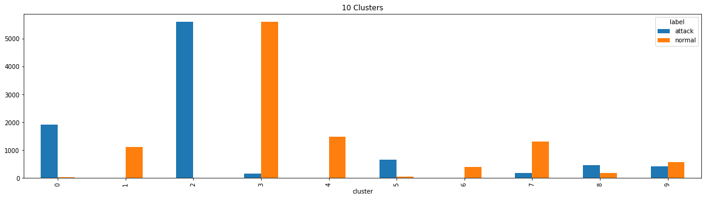
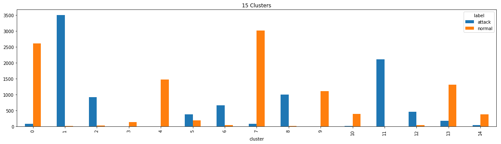
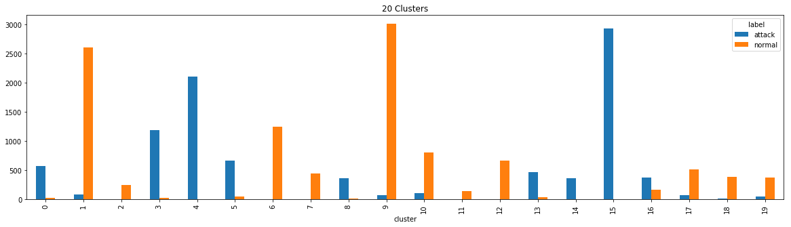
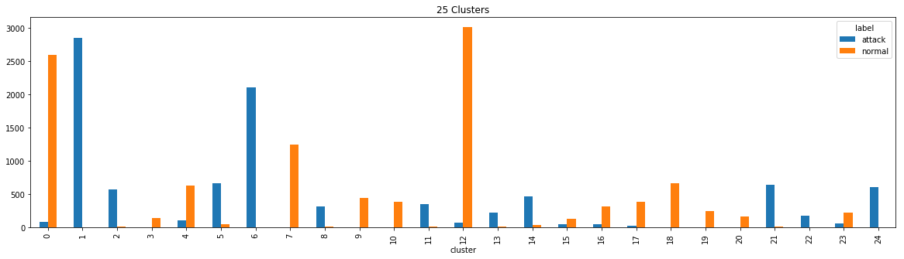
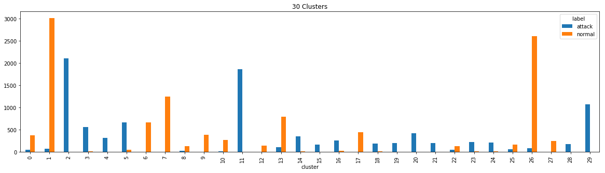
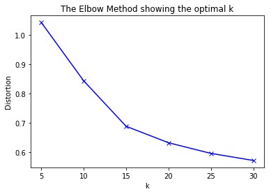

## Network Intrusion Detection Model - KDD Dataset

* NSL-KDD dataset is based on the original KDD'99 which was designed to a predictive model capable of distinguishing between ``attack`` connections, called intrusions, and ``normal`` good connections. 
* This model describes a hybrid clustering-classification approach to improve accuracy rather than a one step model
* You can find more about the dataset and task description [here](http://kdd.ics.uci.edu/databases/kddcup99/task.html)


```python
import pandas as pd
import numpy as np
import seaborn as sns
import matplotlib.pyplot as plt
import warnings
warnings.filterwarnings('ignore')
```

* We have the following data under **NSL_KDD_Dataset**:
    * KDDTrain+.txt: full training dataset of approx 126K row
    * KDDTest+.txt: hold-out dataset for testing
    * KDDTrain+_20Percent.csv: which is a 20 percent of the original NSL-KDD full training dataset
* Data columns described [here](http://www.unb.ca/cic/datasets/nsl.html)


```python
def load_dataset(PATH):
    header = ["duration","protocol_type","service","flag","src_bytes",
        "dst_bytes","land","wrong_fragment","urgent","hot","num_failed_logins",
        "logged_in","num_compromised","root_shell","su_attempted","num_root",
        "num_file_creations","num_shells","num_access_files","num_outbound_cmds",
        "is_host_login","is_guest_login","count","srv_count","serror_rate",
        "srv_serror_rate","rerror_rate","srv_rerror_rate","same_srv_rate",
        "diff_srv_rate","srv_diff_host_rate","dst_host_count","dst_host_srv_count",
        "dst_host_same_srv_rate","dst_host_diff_srv_rate","dst_host_same_src_port_rate",
        "dst_host_srv_diff_host_rate","dst_host_serror_rate","dst_host_srv_serror_rate",
        "dst_host_rerror_rate","dst_host_srv_rerror_rate","label","temp"]
    df = pd.read_csv(PATH, names=header).drop('temp',axis=1)
    return df
```

We'll be using the 20% version for training convience


```python
kdd = load_dataset('NSL_KDD_Dataset/KDDTrain+_20Percent.csv')
```


```python
kdd.shape
```


    (25192, 42)


```python
kdd.head()
```


<div>
<style scoped>
    .dataframe tbody tr th:only-of-type {
        vertical-align: middle;
    }

    .dataframe tbody tr th {
        vertical-align: top;
    }

    .dataframe thead th {
        text-align: right;
    }
</style>
<table border="1" class="dataframe">
  <thead>
    <tr style="text-align: right;">
      <th></th>
      <th>duration</th>
      <th>protocol_type</th>
      <th>service</th>
      <th>flag</th>
      <th>src_bytes</th>
      <th>dst_bytes</th>
      <th>land</th>
      <th>wrong_fragment</th>
      <th>urgent</th>
      <th>hot</th>
      <th>...</th>
      <th>dst_host_srv_count</th>
      <th>dst_host_same_srv_rate</th>
      <th>dst_host_diff_srv_rate</th>
      <th>dst_host_same_src_port_rate</th>
      <th>dst_host_srv_diff_host_rate</th>
      <th>dst_host_serror_rate</th>
      <th>dst_host_srv_serror_rate</th>
      <th>dst_host_rerror_rate</th>
      <th>dst_host_srv_rerror_rate</th>
      <th>label</th>
    </tr>
  </thead>
  <tbody>
    <tr>
      <th>0</th>
      <td>0</td>
      <td>tcp</td>
      <td>ftp_data</td>
      <td>SF</td>
      <td>491</td>
      <td>0</td>
      <td>0</td>
      <td>0</td>
      <td>0</td>
      <td>0</td>
      <td>...</td>
      <td>25</td>
      <td>0.17</td>
      <td>0.03</td>
      <td>0.17</td>
      <td>0.00</td>
      <td>0.00</td>
      <td>0.00</td>
      <td>0.05</td>
      <td>0.00</td>
      <td>normal</td>
    </tr>
    <tr>
      <th>1</th>
      <td>0</td>
      <td>udp</td>
      <td>other</td>
      <td>SF</td>
      <td>146</td>
      <td>0</td>
      <td>0</td>
      <td>0</td>
      <td>0</td>
      <td>0</td>
      <td>...</td>
      <td>1</td>
      <td>0.00</td>
      <td>0.60</td>
      <td>0.88</td>
      <td>0.00</td>
      <td>0.00</td>
      <td>0.00</td>
      <td>0.00</td>
      <td>0.00</td>
      <td>normal</td>
    </tr>
    <tr>
      <th>2</th>
      <td>0</td>
      <td>tcp</td>
      <td>private</td>
      <td>S0</td>
      <td>0</td>
      <td>0</td>
      <td>0</td>
      <td>0</td>
      <td>0</td>
      <td>0</td>
      <td>...</td>
      <td>26</td>
      <td>0.10</td>
      <td>0.05</td>
      <td>0.00</td>
      <td>0.00</td>
      <td>1.00</td>
      <td>1.00</td>
      <td>0.00</td>
      <td>0.00</td>
      <td>neptune</td>
    </tr>
    <tr>
      <th>3</th>
      <td>0</td>
      <td>tcp</td>
      <td>http</td>
      <td>SF</td>
      <td>232</td>
      <td>8153</td>
      <td>0</td>
      <td>0</td>
      <td>0</td>
      <td>0</td>
      <td>...</td>
      <td>255</td>
      <td>1.00</td>
      <td>0.00</td>
      <td>0.03</td>
      <td>0.04</td>
      <td>0.03</td>
      <td>0.01</td>
      <td>0.00</td>
      <td>0.01</td>
      <td>normal</td>
    </tr>
    <tr>
      <th>4</th>
      <td>0</td>
      <td>tcp</td>
      <td>http</td>
      <td>SF</td>
      <td>199</td>
      <td>420</td>
      <td>0</td>
      <td>0</td>
      <td>0</td>
      <td>0</td>
      <td>...</td>
      <td>255</td>
      <td>1.00</td>
      <td>0.00</td>
      <td>0.00</td>
      <td>0.00</td>
      <td>0.00</td>
      <td>0.00</td>
      <td>0.00</td>
      <td>0.00</td>
      <td>normal</td>
    </tr>
  </tbody>
</table>
<p>5 rows × 42 columns</p>
</div>


### Mapping labels to only ```normal``` and ```attack```


```python
def mapping_label(kdd):
    label = []
    for entry in list(kdd.label):
        if(entry != 'normal'):
            label.append('attack')
        else:
            label.append(entry)
    kdd.label = label 
    return kdd
```


```python
kdd = mapping_label(kdd)
```


```python
kdd.label.value_counts()
```


    normal    13449
    attack    11743
    Name: label, dtype: int64


## Data Exploration
Seperating numerical, binary and categorical variables


```python
numerical_features = list(kdd.describe().columns)
categorical_features = list(set(kdd) - set(numerical_features))

```


```python
print(categorical_features)
```

    ['protocol_type', 'service', 'flag', 'label']
    


```python
print(numerical_features)
```

    ['duration', 'src_bytes', 'dst_bytes', 'land', 'wrong_fragment', 'urgent', 'hot', 'num_failed_logins', 'logged_in', 'num_compromised', 'root_shell', 'su_attempted', 'num_root', 'num_file_creations', 'num_shells', 'num_access_files', 'num_outbound_cmds', 'is_host_login', 'is_guest_login', 'count', 'srv_count', 'serror_rate', 'srv_serror_rate', 'rerror_rate', 'srv_rerror_rate', 'same_srv_rate', 'diff_srv_rate', 'srv_diff_host_rate', 'dst_host_count', 'dst_host_srv_count', 'dst_host_same_srv_rate', 'dst_host_diff_srv_rate', 'dst_host_same_src_port_rate', 'dst_host_srv_diff_host_rate', 'dst_host_serror_rate', 'dst_host_srv_serror_rate', 'dst_host_rerror_rate', 'dst_host_srv_rerror_rate']
    

### 1-Numerical and Binary Variables


```python
kdd.describe().T
```


<div>
<style scoped>
    .dataframe tbody tr th:only-of-type {
        vertical-align: middle;
    }

    .dataframe tbody tr th {
        vertical-align: top;
    }

    .dataframe thead th {
        text-align: right;
    }
</style>
<table border="1" class="dataframe">
  <thead>
    <tr style="text-align: right;">
      <th></th>
      <th>count</th>
      <th>mean</th>
      <th>std</th>
      <th>min</th>
      <th>25%</th>
      <th>50%</th>
      <th>75%</th>
      <th>max</th>
    </tr>
  </thead>
  <tbody>
    <tr>
      <th>duration</th>
      <td>25192.0</td>
      <td>305.054104</td>
      <td>2.686556e+03</td>
      <td>0.0</td>
      <td>0.00</td>
      <td>0.00</td>
      <td>0.00</td>
      <td>42862.0</td>
    </tr>
    <tr>
      <th>src_bytes</th>
      <td>25192.0</td>
      <td>24330.628215</td>
      <td>2.410805e+06</td>
      <td>0.0</td>
      <td>0.00</td>
      <td>44.00</td>
      <td>279.00</td>
      <td>381709090.0</td>
    </tr>
    <tr>
      <th>dst_bytes</th>
      <td>25192.0</td>
      <td>3491.847174</td>
      <td>8.883072e+04</td>
      <td>0.0</td>
      <td>0.00</td>
      <td>0.00</td>
      <td>530.25</td>
      <td>5151385.0</td>
    </tr>
    <tr>
      <th>land</th>
      <td>25192.0</td>
      <td>0.000079</td>
      <td>8.909946e-03</td>
      <td>0.0</td>
      <td>0.00</td>
      <td>0.00</td>
      <td>0.00</td>
      <td>1.0</td>
    </tr>
    <tr>
      <th>wrong_fragment</th>
      <td>25192.0</td>
      <td>0.023738</td>
      <td>2.602208e-01</td>
      <td>0.0</td>
      <td>0.00</td>
      <td>0.00</td>
      <td>0.00</td>
      <td>3.0</td>
    </tr>
    <tr>
      <th>urgent</th>
      <td>25192.0</td>
      <td>0.000040</td>
      <td>6.300408e-03</td>
      <td>0.0</td>
      <td>0.00</td>
      <td>0.00</td>
      <td>0.00</td>
      <td>1.0</td>
    </tr>
    <tr>
      <th>hot</th>
      <td>25192.0</td>
      <td>0.198039</td>
      <td>2.154202e+00</td>
      <td>0.0</td>
      <td>0.00</td>
      <td>0.00</td>
      <td>0.00</td>
      <td>77.0</td>
    </tr>
    <tr>
      <th>num_failed_logins</th>
      <td>25192.0</td>
      <td>0.001191</td>
      <td>4.541818e-02</td>
      <td>0.0</td>
      <td>0.00</td>
      <td>0.00</td>
      <td>0.00</td>
      <td>4.0</td>
    </tr>
    <tr>
      <th>logged_in</th>
      <td>25192.0</td>
      <td>0.394768</td>
      <td>4.888105e-01</td>
      <td>0.0</td>
      <td>0.00</td>
      <td>0.00</td>
      <td>1.00</td>
      <td>1.0</td>
    </tr>
    <tr>
      <th>num_compromised</th>
      <td>25192.0</td>
      <td>0.227850</td>
      <td>1.041735e+01</td>
      <td>0.0</td>
      <td>0.00</td>
      <td>0.00</td>
      <td>0.00</td>
      <td>884.0</td>
    </tr>
    <tr>
      <th>root_shell</th>
      <td>25192.0</td>
      <td>0.001548</td>
      <td>3.931635e-02</td>
      <td>0.0</td>
      <td>0.00</td>
      <td>0.00</td>
      <td>0.00</td>
      <td>1.0</td>
    </tr>
    <tr>
      <th>su_attempted</th>
      <td>25192.0</td>
      <td>0.001350</td>
      <td>4.878505e-02</td>
      <td>0.0</td>
      <td>0.00</td>
      <td>0.00</td>
      <td>0.00</td>
      <td>2.0</td>
    </tr>
    <tr>
      <th>num_root</th>
      <td>25192.0</td>
      <td>0.249841</td>
      <td>1.150084e+01</td>
      <td>0.0</td>
      <td>0.00</td>
      <td>0.00</td>
      <td>0.00</td>
      <td>975.0</td>
    </tr>
    <tr>
      <th>num_file_creations</th>
      <td>25192.0</td>
      <td>0.014727</td>
      <td>5.296023e-01</td>
      <td>0.0</td>
      <td>0.00</td>
      <td>0.00</td>
      <td>0.00</td>
      <td>40.0</td>
    </tr>
    <tr>
      <th>num_shells</th>
      <td>25192.0</td>
      <td>0.000357</td>
      <td>1.889822e-02</td>
      <td>0.0</td>
      <td>0.00</td>
      <td>0.00</td>
      <td>0.00</td>
      <td>1.0</td>
    </tr>
    <tr>
      <th>num_access_files</th>
      <td>25192.0</td>
      <td>0.004327</td>
      <td>9.852398e-02</td>
      <td>0.0</td>
      <td>0.00</td>
      <td>0.00</td>
      <td>0.00</td>
      <td>8.0</td>
    </tr>
    <tr>
      <th>num_outbound_cmds</th>
      <td>25192.0</td>
      <td>0.000000</td>
      <td>0.000000e+00</td>
      <td>0.0</td>
      <td>0.00</td>
      <td>0.00</td>
      <td>0.00</td>
      <td>0.0</td>
    </tr>
    <tr>
      <th>is_host_login</th>
      <td>25192.0</td>
      <td>0.000000</td>
      <td>0.000000e+00</td>
      <td>0.0</td>
      <td>0.00</td>
      <td>0.00</td>
      <td>0.00</td>
      <td>0.0</td>
    </tr>
    <tr>
      <th>is_guest_login</th>
      <td>25192.0</td>
      <td>0.009130</td>
      <td>9.511512e-02</td>
      <td>0.0</td>
      <td>0.00</td>
      <td>0.00</td>
      <td>0.00</td>
      <td>1.0</td>
    </tr>
    <tr>
      <th>count</th>
      <td>25192.0</td>
      <td>84.591180</td>
      <td>1.146735e+02</td>
      <td>1.0</td>
      <td>2.00</td>
      <td>14.00</td>
      <td>144.00</td>
      <td>511.0</td>
    </tr>
    <tr>
      <th>srv_count</th>
      <td>25192.0</td>
      <td>27.698754</td>
      <td>7.246824e+01</td>
      <td>1.0</td>
      <td>2.00</td>
      <td>8.00</td>
      <td>18.00</td>
      <td>511.0</td>
    </tr>
    <tr>
      <th>serror_rate</th>
      <td>25192.0</td>
      <td>0.286338</td>
      <td>4.473123e-01</td>
      <td>0.0</td>
      <td>0.00</td>
      <td>0.00</td>
      <td>1.00</td>
      <td>1.0</td>
    </tr>
    <tr>
      <th>srv_serror_rate</th>
      <td>25192.0</td>
      <td>0.283762</td>
      <td>4.475989e-01</td>
      <td>0.0</td>
      <td>0.00</td>
      <td>0.00</td>
      <td>1.00</td>
      <td>1.0</td>
    </tr>
    <tr>
      <th>rerror_rate</th>
      <td>25192.0</td>
      <td>0.118630</td>
      <td>3.187455e-01</td>
      <td>0.0</td>
      <td>0.00</td>
      <td>0.00</td>
      <td>0.00</td>
      <td>1.0</td>
    </tr>
    <tr>
      <th>srv_rerror_rate</th>
      <td>25192.0</td>
      <td>0.120260</td>
      <td>3.223354e-01</td>
      <td>0.0</td>
      <td>0.00</td>
      <td>0.00</td>
      <td>0.00</td>
      <td>1.0</td>
    </tr>
    <tr>
      <th>same_srv_rate</th>
      <td>25192.0</td>
      <td>0.660559</td>
      <td>4.396374e-01</td>
      <td>0.0</td>
      <td>0.09</td>
      <td>1.00</td>
      <td>1.00</td>
      <td>1.0</td>
    </tr>
    <tr>
      <th>diff_srv_rate</th>
      <td>25192.0</td>
      <td>0.062363</td>
      <td>1.785500e-01</td>
      <td>0.0</td>
      <td>0.00</td>
      <td>0.00</td>
      <td>0.06</td>
      <td>1.0</td>
    </tr>
    <tr>
      <th>srv_diff_host_rate</th>
      <td>25192.0</td>
      <td>0.095931</td>
      <td>2.565828e-01</td>
      <td>0.0</td>
      <td>0.00</td>
      <td>0.00</td>
      <td>0.00</td>
      <td>1.0</td>
    </tr>
    <tr>
      <th>dst_host_count</th>
      <td>25192.0</td>
      <td>182.532074</td>
      <td>9.899390e+01</td>
      <td>0.0</td>
      <td>84.00</td>
      <td>255.00</td>
      <td>255.00</td>
      <td>255.0</td>
    </tr>
    <tr>
      <th>dst_host_srv_count</th>
      <td>25192.0</td>
      <td>115.063036</td>
      <td>1.106469e+02</td>
      <td>0.0</td>
      <td>10.00</td>
      <td>61.00</td>
      <td>255.00</td>
      <td>255.0</td>
    </tr>
    <tr>
      <th>dst_host_same_srv_rate</th>
      <td>25192.0</td>
      <td>0.519791</td>
      <td>4.489439e-01</td>
      <td>0.0</td>
      <td>0.05</td>
      <td>0.51</td>
      <td>1.00</td>
      <td>1.0</td>
    </tr>
    <tr>
      <th>dst_host_diff_srv_rate</th>
      <td>25192.0</td>
      <td>0.082539</td>
      <td>1.871911e-01</td>
      <td>0.0</td>
      <td>0.00</td>
      <td>0.03</td>
      <td>0.07</td>
      <td>1.0</td>
    </tr>
    <tr>
      <th>dst_host_same_src_port_rate</th>
      <td>25192.0</td>
      <td>0.147453</td>
      <td>3.083666e-01</td>
      <td>0.0</td>
      <td>0.00</td>
      <td>0.00</td>
      <td>0.06</td>
      <td>1.0</td>
    </tr>
    <tr>
      <th>dst_host_srv_diff_host_rate</th>
      <td>25192.0</td>
      <td>0.031844</td>
      <td>1.105750e-01</td>
      <td>0.0</td>
      <td>0.00</td>
      <td>0.00</td>
      <td>0.02</td>
      <td>1.0</td>
    </tr>
    <tr>
      <th>dst_host_serror_rate</th>
      <td>25192.0</td>
      <td>0.285800</td>
      <td>4.453165e-01</td>
      <td>0.0</td>
      <td>0.00</td>
      <td>0.00</td>
      <td>1.00</td>
      <td>1.0</td>
    </tr>
    <tr>
      <th>dst_host_srv_serror_rate</th>
      <td>25192.0</td>
      <td>0.279846</td>
      <td>4.460753e-01</td>
      <td>0.0</td>
      <td>0.00</td>
      <td>0.00</td>
      <td>1.00</td>
      <td>1.0</td>
    </tr>
    <tr>
      <th>dst_host_rerror_rate</th>
      <td>25192.0</td>
      <td>0.117800</td>
      <td>3.058692e-01</td>
      <td>0.0</td>
      <td>0.00</td>
      <td>0.00</td>
      <td>0.00</td>
      <td>1.0</td>
    </tr>
    <tr>
      <th>dst_host_srv_rerror_rate</th>
      <td>25192.0</td>
      <td>0.118769</td>
      <td>3.173335e-01</td>
      <td>0.0</td>
      <td>0.00</td>
      <td>0.00</td>
      <td>0.00</td>
      <td>1.0</td>
    </tr>
  </tbody>
</table>
</div>


##### Notice that both ``num_outbound_cmds``, and ``is_host_login`` have only 0s, so we'll remove them from our features dataset


```python
kdd=kdd.drop(['num_outbound_cmds','is_host_login'],axis=1)
```

##### Notice that  ``su_attempted``, is a binary feature but have a maximum of 2 so correction is in order


```python
kdd['su_attempted'].replace(2, 1, inplace=True)
kdd.su_attempted.unique()
```


    array([0, 1], dtype=int64)


### 2-Categorical Variables Exploration

#### Protocol Type


```python
ct = pd.crosstab(kdd.protocol_type, kdd.label)
ct
```


<div>
<style scoped>
    .dataframe tbody tr th:only-of-type {
        vertical-align: middle;
    }

    .dataframe tbody tr th {
        vertical-align: top;
    }

    .dataframe thead th {
        text-align: right;
    }
</style>
<table border="1" class="dataframe">
  <thead>
    <tr style="text-align: right;">
      <th>label</th>
      <th>attack</th>
      <th>normal</th>
    </tr>
    <tr>
      <th>protocol_type</th>
      <th></th>
      <th></th>
    </tr>
  </thead>
  <tbody>
    <tr>
      <th>icmp</th>
      <td>1394</td>
      <td>261</td>
    </tr>
    <tr>
      <th>tcp</th>
      <td>9845</td>
      <td>10681</td>
    </tr>
    <tr>
      <th>udp</th>
      <td>504</td>
      <td>2507</td>
    </tr>
  </tbody>
</table>
</div>


#### Service Type


```python
ct= pd.crosstab(kdd['service'], kdd['label'])
ct.plot.bar(figsize=(20,5), stacked=True)
plt.title('Service Type')
plt.show()
```





#### Flag


```python
ct = pd.crosstab(kdd['flag'], kdd['label'])
ct.T

```


<div>
<style scoped>
    .dataframe tbody tr th:only-of-type {
        vertical-align: middle;
    }

    .dataframe tbody tr th {
        vertical-align: top;
    }

    .dataframe thead th {
        text-align: right;
    }
</style>
<table border="1" class="dataframe">
  <thead>
    <tr style="text-align: right;">
      <th>flag</th>
      <th>OTH</th>
      <th>REJ</th>
      <th>RSTO</th>
      <th>RSTOS0</th>
      <th>RSTR</th>
      <th>S0</th>
      <th>S1</th>
      <th>S2</th>
      <th>S3</th>
      <th>SF</th>
      <th>SH</th>
    </tr>
    <tr>
      <th>label</th>
      <th></th>
      <th></th>
      <th></th>
      <th></th>
      <th></th>
      <th></th>
      <th></th>
      <th></th>
      <th></th>
      <th></th>
      <th></th>
    </tr>
  </thead>
  <tbody>
    <tr>
      <th>attack</th>
      <td>4</td>
      <td>1701</td>
      <td>260</td>
      <td>21</td>
      <td>469</td>
      <td>6929</td>
      <td>2</td>
      <td>4</td>
      <td>0</td>
      <td>2310</td>
      <td>43</td>
    </tr>
    <tr>
      <th>normal</th>
      <td>1</td>
      <td>515</td>
      <td>44</td>
      <td>0</td>
      <td>28</td>
      <td>80</td>
      <td>86</td>
      <td>17</td>
      <td>15</td>
      <td>12663</td>
      <td>0</td>
    </tr>
  </tbody>
</table>
</div>


### Preparing X, and Y


```python
kdd_X = kdd.drop('label',axis=1)
```


```python
kdd_Y = kdd.label
```

#### One-Hot-Encoding for X


```python
kdd_X_OHE = pd.get_dummies(kdd_X) 
```

### Train, validation split by 80%, 20% respectively 


```python
from sklearn.model_selection import train_test_split

X_train, X_test, y_train, y_test = train_test_split(kdd_X_OHE, kdd_Y, test_size=0.2, random_state=0)
```


```python
X_train.head()
```


<div>
<style scoped>
    .dataframe tbody tr th:only-of-type {
        vertical-align: middle;
    }

    .dataframe tbody tr th {
        vertical-align: top;
    }

    .dataframe thead th {
        text-align: right;
    }
</style>
<table border="1" class="dataframe">
  <thead>
    <tr style="text-align: right;">
      <th></th>
      <th>duration</th>
      <th>src_bytes</th>
      <th>dst_bytes</th>
      <th>land</th>
      <th>wrong_fragment</th>
      <th>urgent</th>
      <th>hot</th>
      <th>num_failed_logins</th>
      <th>logged_in</th>
      <th>num_compromised</th>
      <th>...</th>
      <th>flag_REJ</th>
      <th>flag_RSTO</th>
      <th>flag_RSTOS0</th>
      <th>flag_RSTR</th>
      <th>flag_S0</th>
      <th>flag_S1</th>
      <th>flag_S2</th>
      <th>flag_S3</th>
      <th>flag_SF</th>
      <th>flag_SH</th>
    </tr>
  </thead>
  <tbody>
    <tr>
      <th>5441</th>
      <td>0</td>
      <td>1032</td>
      <td>0</td>
      <td>0</td>
      <td>0</td>
      <td>0</td>
      <td>0</td>
      <td>0</td>
      <td>0</td>
      <td>0</td>
      <td>...</td>
      <td>0</td>
      <td>0</td>
      <td>0</td>
      <td>0</td>
      <td>0</td>
      <td>0</td>
      <td>0</td>
      <td>0</td>
      <td>1</td>
      <td>0</td>
    </tr>
    <tr>
      <th>17656</th>
      <td>0</td>
      <td>105</td>
      <td>146</td>
      <td>0</td>
      <td>0</td>
      <td>0</td>
      <td>0</td>
      <td>0</td>
      <td>0</td>
      <td>0</td>
      <td>...</td>
      <td>0</td>
      <td>0</td>
      <td>0</td>
      <td>0</td>
      <td>0</td>
      <td>0</td>
      <td>0</td>
      <td>0</td>
      <td>1</td>
      <td>0</td>
    </tr>
    <tr>
      <th>9865</th>
      <td>0</td>
      <td>297</td>
      <td>2762</td>
      <td>0</td>
      <td>0</td>
      <td>0</td>
      <td>0</td>
      <td>0</td>
      <td>1</td>
      <td>0</td>
      <td>...</td>
      <td>0</td>
      <td>0</td>
      <td>0</td>
      <td>0</td>
      <td>0</td>
      <td>0</td>
      <td>0</td>
      <td>0</td>
      <td>1</td>
      <td>0</td>
    </tr>
    <tr>
      <th>3616</th>
      <td>0</td>
      <td>334</td>
      <td>0</td>
      <td>0</td>
      <td>0</td>
      <td>0</td>
      <td>0</td>
      <td>0</td>
      <td>1</td>
      <td>0</td>
      <td>...</td>
      <td>0</td>
      <td>0</td>
      <td>0</td>
      <td>0</td>
      <td>0</td>
      <td>0</td>
      <td>0</td>
      <td>0</td>
      <td>1</td>
      <td>0</td>
    </tr>
    <tr>
      <th>9769</th>
      <td>0</td>
      <td>0</td>
      <td>0</td>
      <td>0</td>
      <td>0</td>
      <td>0</td>
      <td>0</td>
      <td>0</td>
      <td>0</td>
      <td>0</td>
      <td>...</td>
      <td>0</td>
      <td>0</td>
      <td>0</td>
      <td>0</td>
      <td>1</td>
      <td>0</td>
      <td>0</td>
      <td>0</td>
      <td>0</td>
      <td>0</td>
    </tr>
  </tbody>
</table>
<p>5 rows × 116 columns</p>
</div>


```python
y_train.head()
```


    5441     attack
    17656    normal
    9865     normal
    3616     attack
    9769     attack
    Name: label, dtype: object


### Minmax scaling for normalization


```python
from sklearn.preprocessing import MinMaxScaler
scaler = MinMaxScaler()
X_train_scaled = scaler.fit_transform(X_train)
# we must apply the scaling to the test set that we computed for the training set
X_test_scaled = scaler.transform(X_test)
```

# Modeling Starts Here

## Clustering with k-means

* we will try different clusters and using elbow method we'll use a nice k option


```python
from sklearn.cluster import KMeans
from sklearn import metrics
from scipy.spatial.distance import cdist
import numpy as np
import matplotlib.pyplot as plt


distortions = []
K = list([5, 10, 15, 20, 25, 30])
for k in K:
    kmeanModel = KMeans(n_clusters=k, random_state=0).fit(X_train_scaled)
    distortions.append(sum(np.min(cdist(X_train_scaled, kmeanModel.cluster_centers_, 'euclidean'), axis=1)) / X_train_scaled.shape[0])
    ct= pd.crosstab(kmeanModel.labels_, y_train)
    ct.plot.bar(figsize=(20,5))
    plt.title(str(k) + ' Clusters')
    plt.xlabel('cluster')
    plt.show()

 
```




















```python
# Plot the elbow
plt.plot(K, distortions, 'bx-')
plt.xlabel('k')
plt.ylabel('Distortion')
plt.title('The Elbow Method showing the optimal k')
plt.show()
```





### Conclusion: 
* We'll be using a 15-cluster kmeans
* We'll keep the cluster for each record to apply the second step classifier


```python
kmeans = KMeans(n_clusters=15, random_state=0).fit(X_train_scaled)
```


```python
X_train['cluster'] = list(kmeans.labels_)
X_train['label'] = y_train
```

## Clustres are splitted into 3 categories. 
* Frist category contains clusters that have both 'attack' and 'normal' connections and have more than 25 point each.
    * a classifier is applied.
* Second category contains clusters that have:
    * One of the labels have more than 25, and the other have less than 25
    * e.g. 125 normal connections, and 10 attack connections
        * We map this cluster based on majority

* Third category if a cluster have less than 25 connections in total:
    * map all to attack as outliers


```python
def split_clusters(X,y):
    lc_df = pd.crosstab(y,X.cluster,margins=True).T[:-1]
    to_classify = []
    for index, row in lc_df.iterrows():
        if((row.attack >= 25) & (row.normal >= 25)):
            to_classify.append(index)
    mapping_clusters = list(set(pd.Series(X_train.cluster).unique()) - set(to_classify))
    return to_classify, mapping_clusters, lc_df
```


```python
to_classify, mapping_clusters, lc_df = split_clusters(X_train, y_train)
```


```python
lc_df.T
```


<div>
<style scoped>
    .dataframe tbody tr th:only-of-type {
        vertical-align: middle;
    }

    .dataframe tbody tr th {
        vertical-align: top;
    }

    .dataframe thead th {
        text-align: right;
    }
</style>
<table border="1" class="dataframe">
  <thead>
    <tr style="text-align: right;">
      <th>cluster</th>
      <th>0</th>
      <th>1</th>
      <th>2</th>
      <th>3</th>
      <th>4</th>
      <th>5</th>
      <th>6</th>
      <th>7</th>
      <th>8</th>
      <th>9</th>
      <th>10</th>
      <th>11</th>
      <th>12</th>
      <th>13</th>
      <th>14</th>
    </tr>
    <tr>
      <th>label</th>
      <th></th>
      <th></th>
      <th></th>
      <th></th>
      <th></th>
      <th></th>
      <th></th>
      <th></th>
      <th></th>
      <th></th>
      <th></th>
      <th></th>
      <th></th>
      <th></th>
      <th></th>
    </tr>
  </thead>
  <tbody>
    <tr>
      <th>attack</th>
      <td>83</td>
      <td>3498</td>
      <td>916</td>
      <td>6</td>
      <td>0</td>
      <td>375</td>
      <td>664</td>
      <td>75</td>
      <td>994</td>
      <td>6</td>
      <td>14</td>
      <td>2104</td>
      <td>464</td>
      <td>175</td>
      <td>43</td>
    </tr>
    <tr>
      <th>normal</th>
      <td>2603</td>
      <td>17</td>
      <td>22</td>
      <td>137</td>
      <td>1475</td>
      <td>187</td>
      <td>46</td>
      <td>3011</td>
      <td>18</td>
      <td>1107</td>
      <td>388</td>
      <td>1</td>
      <td>35</td>
      <td>1308</td>
      <td>381</td>
    </tr>
    <tr>
      <th>All</th>
      <td>2686</td>
      <td>3515</td>
      <td>938</td>
      <td>143</td>
      <td>1475</td>
      <td>562</td>
      <td>710</td>
      <td>3086</td>
      <td>1012</td>
      <td>1113</td>
      <td>402</td>
      <td>2105</td>
      <td>499</td>
      <td>1483</td>
      <td>424</td>
    </tr>
  </tbody>
</table>
</div>


#### Clusters with attack normal, more than 25 each
#### Mapping clusters based on majority
#### We don't have the third case here but we'll cover it anyways with majority case


```python
to_classify
```


    [0, 5, 6, 7, 12, 13, 14]


```python
mapping_clusters
```


    [1, 2, 3, 4, 8, 9, 10, 11]


```python
outliers
```


    []


###### Mapping based on majority, and outliers clusters:


```python
def mapping_each_cluster_with_right_type(mapping_clusters, X,y):
    mapping_df = X[X.cluster.isin(mapping_clusters)]
    to_mapDF = pd.crosstab(mapping_df.cluster,y,margins=True)[:-1]
    majority = []
    new_label = []
    outliers = []
    for index, row in to_mapDF.iterrows():
        if((row.normal > 25) & (row.attack <= 25)):
            majority.append(index)
            new_label.append([index,'normal'])
        elif((row.normal < 25) & (row.attack >= 25)):
            majority.append(index)
            new_label.append([index,'attack'])
        else:
            outliers.append(index)
    return majority, new_label, outliers
```


```python
majority, new_label, outliers = mapping_each_cluster_with_right_type(mapping_clusters, X_train, y_train)
```


```python
def get_predicted_based_on_majority(majority, X):
    majority_df = X[X.cluster.isin(majority)]
    majority_df['predicted'] = '0'
    for index, row in majority_df.iterrows():
        for i in new_label:
            if(row.cluster == i[0]):
                  majority_df.at[index,'predicted'] = i[1]
    return majority_df
```


```python
majority_df = get_predicted_based_on_majority(majority, X_train)
```


```python
pd.crosstab(majority_df['predicted'], majority_df['cluster'])
```


<div>
<style scoped>
    .dataframe tbody tr th:only-of-type {
        vertical-align: middle;
    }

    .dataframe tbody tr th {
        vertical-align: top;
    }

    .dataframe thead th {
        text-align: right;
    }
</style>
<table border="1" class="dataframe">
  <thead>
    <tr style="text-align: right;">
      <th>cluster</th>
      <th>1</th>
      <th>2</th>
      <th>3</th>
      <th>4</th>
      <th>8</th>
      <th>9</th>
      <th>10</th>
      <th>11</th>
    </tr>
    <tr>
      <th>predicted</th>
      <th></th>
      <th></th>
      <th></th>
      <th></th>
      <th></th>
      <th></th>
      <th></th>
      <th></th>
    </tr>
  </thead>
  <tbody>
    <tr>
      <th>attack</th>
      <td>3515</td>
      <td>938</td>
      <td>0</td>
      <td>0</td>
      <td>1012</td>
      <td>0</td>
      <td>0</td>
      <td>2105</td>
    </tr>
    <tr>
      <th>normal</th>
      <td>0</td>
      <td>0</td>
      <td>143</td>
      <td>1475</td>
      <td>0</td>
      <td>1113</td>
      <td>402</td>
      <td>0</td>
    </tr>
  </tbody>
</table>
</div>


```python
def get_outliers_mapping(outliers, X):
    outliers_df = X[X.cluster.isin(outliers)] 
    outliers_df['predicted'] = 'attack'
    return outliers_df
```


```python
outliers_df = get_outliers_mapping(outliers, X_train)
```

### Classification starts here


```python
def get_classify_df(to_classify, X):
    classify_df = X[X.cluster.isin(to_classify)]
    return classify_df
```


```python
classify_df = get_classify_df(to_classify, X_train)
```

#### Model Selection


```python
from sklearn.linear_model import LogisticRegression
from sklearn.tree import DecisionTreeClassifier
from sklearn.ensemble import RandomForestClassifier
from sklearn.neighbors import KNeighborsClassifier
from sklearn.discriminant_analysis import LinearDiscriminantAnalysis
from sklearn.naive_bayes import GaussianNB
from sklearn.svm import SVC

from sklearn.model_selection import train_test_split
from sklearn.model_selection import cross_val_score
from sklearn.model_selection import KFold

models = [('LR', LogisticRegression()),
         ('KNN', KNeighborsClassifier()),
         ('CART', DecisionTreeClassifier()),
         ('NB', GaussianNB()),
         ('SVM', SVC(max_iter=500)),
         ('RF', RandomForestClassifier())]
seed = 0
results = []
names = []
scoring = 'accuracy'
X = scaler.fit_transform(classify_df.drop(['label','cluster'],axis=1))
Y = classify_df['label']
for name, model in models:
    kfold = KFold(n_splits=10, random_state=seed)
    cv_results = cross_val_score(model, X, Y, cv=kfold, scoring=scoring)
    results.append(cv_results)
    names.append(name)
    msg = "%s: %f (%f)" % (name, cv_results.mean(), cv_results.std())
    print(msg)
```

    LR: 0.949947 (0.003606)
    KNN: 0.984444 (0.004100)
    CART: 0.994180 (0.001966)
    NB: 0.497672 (0.257454)
    SVM: 0.938942 (0.004565)
    RF: 0.995661 (0.001202)
    

We'll go with the Random Forest


```python
clf = RandomForestClassifier()
clf.fit(X,Y)
```


    RandomForestClassifier(bootstrap=True, class_weight=None, criterion='gini',
                max_depth=None, max_features='auto', max_leaf_nodes=None,
                min_impurity_decrease=0.0, min_impurity_split=None,
                min_samples_leaf=1, min_samples_split=2,
                min_weight_fraction_leaf=0.0, n_estimators=10, n_jobs=1,
                oob_score=False, random_state=None, verbose=0,
                warm_start=False)


```python
classify_df['predicted'] = clf.predict(X)
```

### Let's add up all results now


```python
def get_res_df(classify_df, majority_df, outliers_df):
    res_df = classify_df.copy()
    res_df = res_df.append(majority_df)
    res_df = res_df.append(outliers_df)
    res_df = res_df.sort_index()
    return res_df
```


```python
train_res_df = get_res_df(classify_df, majority_df, outliers_df)
```

#### Training Dataset Accuracy


```python
from sklearn.metrics import accuracy_score
accuracy_score(list(y_train.sort_index()), list(train_res_df.predicted))
```


    0.9957822656676425


```python
from sklearn.metrics import classification_report
print(classification_report(list(X_train.label.sort_index()), list(train_res_df.predicted)))
```

                 precision    recall  f1-score   support
    
         attack       0.99      1.00      1.00      9417
         normal       1.00      0.99      1.00     10736
    
    avg / total       1.00      1.00      1.00     20153
    
    

## Validation Dataset


```python
X_test['cluster'] = kmeans.predict(X_test_scaled)
X_test['label'] = y_test
```


```python
X_test_majority_df = get_predicted_based_on_majority(majority,X_test)
X_test_outliers_df = get_outliers_mapping(outliers, X_test)
X_test_classify_df = get_classify_df(to_classify, X_test)
X_test_classify_df['predicted'] = clf.predict(X_test_classify_df.drop(['cluster','label'],axis=1))
X_test_res_df = get_res_df(X_test_classify_df, X_test_majority_df, X_test_outliers_df)
```

### Validation Set Accuracy


```python
print(accuracy_score(list(y_test.sort_index()), list(X_test_res_df.predicted)))
print(classification_report(list(X_test_res_df.predicted), list(X_test_res_df.label)))
```

    0.9718198055169677
                 precision    recall  f1-score   support
    
         attack       0.98      0.96      0.97      2384
         normal       0.96      0.98      0.97      2655
    
    avg / total       0.97      0.97      0.97      5039
    
    

### NEXT Steps:
* Training on ```'NSL_KDD_Dataset/KDDTrain+.txt'```
* Testing with ```'NSL_KDD_Dataset/KDDTest+.txt'```
